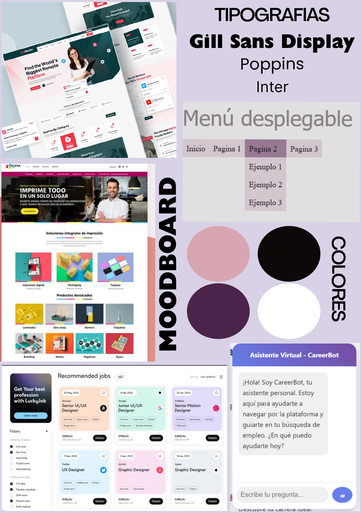

# 🚀 Inserción Laboral para Jóvenes sin Experiencia -ENTREGA 1

## 💡 Problemática

En Argentina, miles de jóvenes estudiantes enfrentan una gran barrera: **insertarse en el mundo laboral sin contar con experiencia previa**. Esta falta de experiencia, sumada a la escasa orientación vocacional en muchas instituciones, dificulta el acceso a oportunidades laborales formales y de calidad.

Nuestro objetivo es brindar herramientas concretas que acompañen a quienes están dando sus primeros pasos en la búsqueda laboral.

## 🎯 Relación con los Objetivos de Desarrollo Sostenible (ODS)

Este proyecto contribuye a los siguientes ODS:

- **ODS 4 – Educación de calidad:** brindamos recursos educativos accesibles para fortalecer habilidades clave.
- **ODS 8 – Trabajo decente y crecimiento económico:** fomentamos la inclusión laboral juvenil, promoviendo empleabilidad en sectores emergentes.
- **ODS 10 – Reducción de las desigualdades:** apuntamos a cerrar la brecha entre jóvenes con acceso a recursos y quienes no los tienen.

## 💻 Solución tecnológica

Estamos desarrollando una **plataforma web accesible y simple** que ofrece:

- **Creación y mejora de CV**: con plantillas editables y recomendaciones personalizadas.
- **Simulaciones de entrevistas**: individuales y grupales, con feedback generado por IA.
- **Cursos gratuitos + exámenes de práctica**: para adquirir habilidades técnicas y blandas.
- **Recursos útiles y talleres** sobre trabajo en equipo, comunicación, liderazgo y más.

> Nuestra propuesta se apoya en herramientas de IA para mejorar la experiencia del usuario, personalizar los recursos y asistir en simulaciones en tiempo real.

## 🧠 Moodboard

Nuestro moodboard está inspirado en un diseño moderno, accesible y amigable, utilizando colores cálidos y formas suaves para transmitir contención, crecimiento y energía joven.

## 🤖 Archivos generados con IA

Los siguientes archivos fueron creados con asistencia de inteligencia artificial:

- `index.html`
- `style.css`
- `script.js`

## 🛠️ Tecnologías utilizadas

- HTML5  
- CSS  
- JavaScript  

## 🔮 Próximas funcionalidades

- 🤖 **Bot guía / reclutador virtual**: orientará al usuario, participará en entrevistas simuladas y generará informes personalizados con feedback y tips.

---

### 💬 ¡Gracias por leernos!

Este proyecto fue desarrollado en el marco del curso **Programación Asistida con IA** de **Chicas en Tecnología** 💜.

# Entrega #2 (Final): 

se esperan modificaciones en el código respecto a la entrega anterior, que pueden incluir nuevos archivos o extensión de los existentes (debe haber al menos un archivo de cada lenguaje visto - HTML, CSS y Javascript)